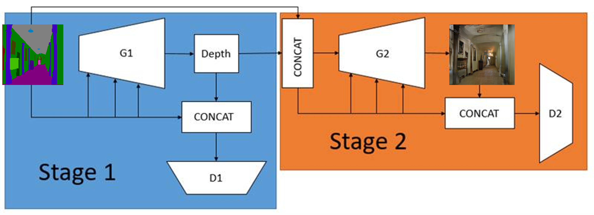

# Depth-and-Semantic-Aware-Image-Generation
Bachelor's thesis: [Depth and Semantic Aware Image Generation](https://taai2022.github.io/dprogram.html). The 27th International Conference on Technologies and Applications of Artificial Intelligence (TAAI) 2022 Domestic Track (oral).

## Preparation and Process

This repository refers to [SPADE](https://github.com/NVlabs/SPADE).
Modify the model architecture of SPADE to our proposed two-stage model architecture.
1. First, use the official weight files provided in [monodepth2](https://github.com/nianticlabs/monodepth2) to predict the depth images of all training data as the ground truth for later use.
2. Train the original [SPADE architecture](https://github.com/NVlabs/SPADE) to output depth images instead of real images.
3. Next, train [our proposed model](https://taai2022.github.io/dprogram.html), combining segmentation images and depth images as the input, with the output remaining the same as the original SPADE.
4. Combining these two models enables end-to-end prediction.
5. Finally, we choose [FID](https://github.com/mseitzer/pytorch-fid) as the evaluation method for image generation

## Folder and code description

- **SPADE-seg2dep & SPADE-seg_dep2rgb**:  
  Respectively contain the models for stage one and stage two, but all the files have not been combined yet.
- **data**:  
  Store our proposed documents, oral presentation materials, and demonstration diagrams.
- **image folder**:  
  Images pending processing.
- **datasets**:  
  Store images for training.  
- **results**:  
  Store the result images predicted by the model.
- **models**:  
  Store the network architecture of the model.
- **train.py & test.py**:  
  Respectively the code for training and predicting models.
  